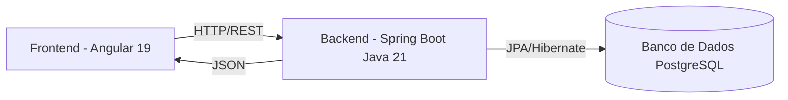

# 📚 Plataforma Digital Integrada para Interação Acadêmica

## 📝 Descrição do Projeto
Este projeto consiste no desenvolvimento de uma **plataforma digital fullstack** voltada para potencializar a interação entre **professores e alunos** da UNINASSAU.  
O objetivo é proporcionar um ambiente **dinâmico, acessível e intuitivo**, integrando recursos de comunicação em tempo real, acompanhamento de atividades acadêmicas e troca de conhecimento de maneira simples e eficiente.

A solução foi projetada com foco na **experiência do usuário**, garantindo uma interface clara, fácil de usar e acessível para todos os perfis — professores, alunos e administradores.  
Além disso, a plataforma conta com funcionalidades colaborativas, como fóruns, chats e espaços de feedback, fortalecendo o vínculo entre ensino e aprendizagem.

---

## 🎯 Objetivos
- Facilitar a comunicação entre professores e alunos.
- Centralizar informações acadêmicas em um único ambiente.
- Acompanhar desempenho e progresso dos estudantes.
- Disponibilizar fóruns, chats e grupos de discussão.
- Melhorar a experiência de aprendizagem com uma UI intuitiva.
- Garantir segurança no armazenamento e compartilhamento de dados.
- Oferecer calendário acadêmico, prazos de entrega e avisos.
- Estimular maior engajamento e participação ativa dos alunos.
- Apoiar professores na gestão de turmas, atividades e avaliações.
- Modernizar o ambiente acadêmico alinhado às tendências tecnológicas.

---

## 🖥️ Tecnologias Utilizadas

### Backend
- **Java**: 21  
- **Spring Boot**: última versão estável  
- **Spring Data JPA** para persistência  
- **Spring Security** (opcional) para autenticação/autorização  
- **Banco de dados**: PostgreSQL (padrão, pode ser substituído)  

### Frontend
- **Angular**: 19  
- **Node.js**: 22  
- **NPM**: 10  
- **TailwindCSS** ou **Angular Material** para UI  
- **Axios / HttpClient** para consumo da API REST  

---

## 📂 Estrutura do Projeto

```bash
projeto-fullstack/
│
├── backend/                   # Código do backend (Spring Boot)
│   ├── src/main/java
│   │   └── com.example.app
│   │       ├── controller/   # Controllers REST
│   │       ├── service/      # Regras de negócio
│   │       ├── repository/   # Interfaces JPA
│   │       └── model/        # Entidades do sistema
│   └── pom.xml
│
├── frontend/                  # Código do frontend (Angular)
│   ├── src/
│   │   ├── app/
│   │   │   ├── components/   # Componentes reutilizáveis
│   │   │   ├── pages/        # Páginas do sistema
│   │   │   └── services/     # Serviços de integração com API
│   └── package.json
│
└── README.md
```

---

## 🏗️ Arquitetura do Sistema



---

## 🚀 Como Rodar o Projeto

### 1️⃣ Clonar o repositório
```bash
git clone https://github.com/seu-usuario/plataforma-academica.git
cd plataforma-academica
```

### 2️⃣ Rodar o Backend (Spring Boot)
1. Acesse a pasta do backend:
   ```bash
   cd backend
   ```
2. Compile e rode o projeto:
   ```bash
   ./mvnw spring-boot:run
   ```
3. O backend estará disponível em:  
   [http://localhost:8080](http://localhost:8080)

---

### 3️⃣ Rodar o Frontend (Angular)
1. Acesse a pasta do frontend:
   ```bash
   cd frontend
   ```
2. Instale as dependências:
   ```bash
   npm install
   ```
3. Rode o servidor de desenvolvimento:
   ```bash
   ng serve
   ```
4. Abra no navegador:  
   [http://localhost:4200](http://localhost:4200)

---

## ✅ Funcionalidades Principais
- 📅 **Calendário Acadêmico**: prazos de entrega e datas de prova.
- 💬 **Chat em Tempo Real**: interação instantânea entre professores e alunos.
- 🏆 **Acompanhamento de Desempenho**: notas e progresso dos alunos.
- 📢 **Avisos e Notificações**: comunicados importantes para a turma.
- 👥 **Fóruns de Discussão**: troca de conhecimento entre os participantes.
- 🔒 **Autenticação Segura**: login e controle de acesso por perfil.

---

## 👨‍💻 Equipe de Desenvolvimento
- **Rafael Victor** — Mat.: 03351641  
- **Rhian Pablo** — Mat.: 03347356  

---

## 📜 Licença
Este projeto é de uso acadêmico e foi desenvolvido como parte do trabalho de **Arquitetura de Software** da UNINASSAU.
